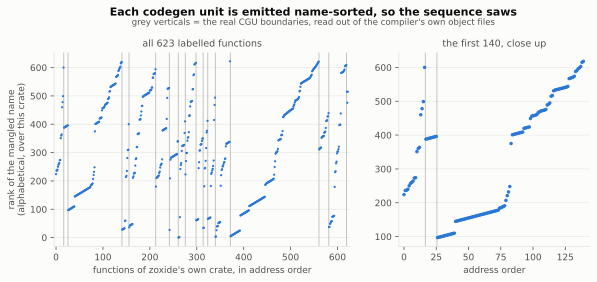
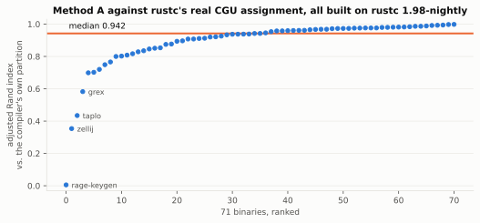
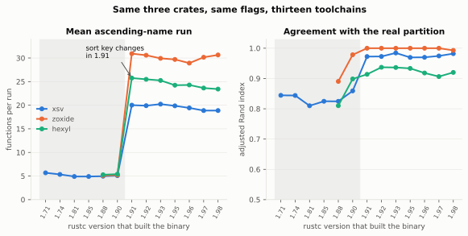
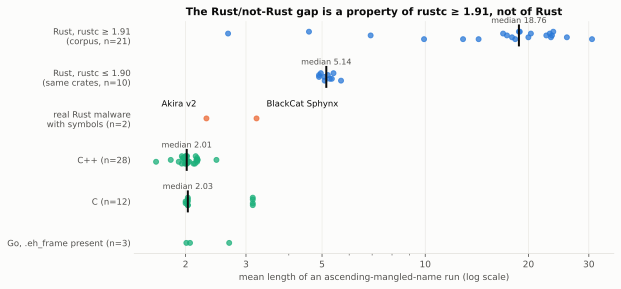

## The problem, if you've ever opened one

You load a stripped Rust binary. Three thousand functions, none of them named, none of them grouped. You know — because everyone says so — that most of this isn't the author's code. It's `core`, it's `alloc`, it's `std`, it's whatever crates they pulled in. Usually under 10% of what you're looking at is anything the author actually typed.

Knowing that doesn't help. You still have to find the 10%.

The usual advice is to work from strings, or from the entry point, or from panic messages, and fan outwards. That works, and it's slow, and it gives you one function at a time.

I went looking for something structural instead — something in how the binary was *built* that would let you triage in blocks rather than one function at a time. This post is the mechanism I found, what it reliably gives you, and the two things that decide whether it gives you anything at all on your particular target.

The tool is [cgumap](https://github.com/sreeharipj/cgumap). The results behind the numbers below are in the same repo.

There's a run on a real ransomware sample at the end, if you want to see what it looks like before reading how it was measured.

---

## rustc doesn't compile your crate as one thing

Here's the piece most reversing material skips over.

When rustc compiles a crate, it doesn't hand LLVM one big module. It splits the crate into **codegen units** — CGUs — and hands LLVM each one separately. In a release build the default is **16**.

The reasoning is in the module docs of `rustc_monomorphize::partitioning`, and it's worth reading because it explains the shape of what ends up in your binary:

> The most important opportunity for saving on compilation time with incremental compilation is to avoid re-codegenning and re-optimizing code. Since the unit of codegen and optimization for LLVM is "modules" or, how we call them "codegen units", the particulars of how much time can be saved by incremental compilation are tightly linked to how the output program is partitioned into these codegen units prior to passing it to LLVM.

Small CGUs mean better incremental rebuilds and more parallelism. Big CGUs mean LLVM can inline across more code and generate faster output. Sixteen is the compromise.

You can see this directly. Build anything with `-C save-temps` and rustc leaves the intermediate object files on disk:

```
$ RUSTFLAGS="-C save-temps" cargo build --release
$ ls target/release/deps/ | grep "hexyl.*cgu"
hexyl-96cae0a33ca3d506.hexyl.b82e054f0bc8471d-cgu.00.rcgu.o
hexyl-96cae0a33ca3d506.hexyl.b82e054f0bc8471d-cgu.01.rcgu.o
...
hexyl-96cae0a33ca3d506.hexyl.b82e054f0bc8471d-cgu.15.rcgu.o
hexyl-c33be41c2484d24f.hexyl.ad0b171be44d563d-cgu.00.rcgu.o
...
hexyl-c33be41c2484d24f.hexyl.ad0b171be44d563d-cgu.14.rcgu.o
```

Thirty-one object files, not sixteen. Two things are going on. `hexyl` has both a library target and a binary target, and each is its own rustc invocation with its own set of CGUs — that's the two different hashes. (This bites you if you write tooling around it: my ground-truth extractor silently produced zero rows for every crate shaped like this until I noticed.) And one of the two came out with fifteen units rather than sixteen, because rustc merges units that end up too small. Sixteen is a target, not a guarantee.

This is also the reason for the thing that annoys everyone about Rust binaries — the same function appearing four or five times at different addresses. When optimizations are on, every CGU that needs an inlinable item gets **its own private copy** of it. That's `InstantiationMode::LocalCopy`, and it's deliberate. Note it's *inlinable* items, not generics as such: an ordinary non-`#[inline]` generic monomorphization is emitted once and shared.

So far this is just background. Here's the part that turns it into a signal.

---

## rustc sorts each unit before it emits it

Inside `rustc_middle`, there's a function called `items_in_deterministic_order` (`compiler/rustc_middle/src/mono.rs`). Every CGU's contents go through it on the way to LLVM. On current rustc the core of it is one line:

```rust
items.sort_by_cached_key(|&(i, _)| i.symbol_name(tcx));
```

**Each codegen unit is emitted sorted by full mangled symbol name.** Not by source order, not by module, not by declaration order. Alphabetically, by the mangled name.

This isn't incidental — it's there so that LLVM sees related symbols near each other, which is a cache-locality win. And because it's deliberate, it's stable. Same crate, same compiler, same order.

Hold onto "same compiler." That exact line is younger than most Rust binaries in the wild, and there's a section below on what changes when your target predates it. The short version is that the older key sorts on a tuple rather than a bare name, which weakens this effect without removing it.

Now add the linker. Handed a list of object files, it lays each one down and moves to the next; it does not re-sort your functions into some global order of its own. Put those two facts together and you get a testable claim:

> If you walk the functions of a linked Rust binary in **address** order and read off their mangled names, the names should **ascend** while you're inside one codegen unit — and **drop** at the moment you cross into the next one, because the next unit starts its own sort over from the beginning.

That's the whole hypothesis. A CGU boundary should look like a sorted list restarting.

It does. Here is `zoxide`'s own code, plotted as *rank of the mangled name* against address order, with the real CGU boundaries — read out of the compiler's own object files — drawn in grey:



The clean ramps are the mechanism. The messy stretch in the middle is the over-segmentation, and it has a cause — two of them, further down.

---

## Reading it back out

Here's what that looks like without the plot — real address-sorted symbols from that binary, demangled, with the CGU each one actually came from:

```
0x000551c0  cgu.00   core::ptr::drop_glue::<clap_builder::builder::command::Command>
0x000556c0  cgu.00   core::ptr::drop_glue::<clap_builder::builder::arg_group::ArgGroup>
0x00055720  cgu.00   core::ptr::drop_glue::<std::io::stdio::StdoutLock>
0x00055750  cgu.00   core::ptr::drop_glue::<clap_builder::parser::matches::arg_matches::ArgMatches>
0x000558a0  cgu.00   <zoxide::cmd::cmd::Edit>::get_fzf
0x00055b70  cgu.00   <zoxide::cmd::cmd::Cmd as zoxide::cmd::Run>::run
0x000580b0  cgu.00   <() as askama::values::Values>::get_value
0x000580c0  cgu.00   <zoxide::cmd::cmd::Cmd as clap_builder::derive::Subcommand>::augment_subcommands
0x00060080  cgu.00   <zoxide::cmd::cmd::InitShell as clap_builder::derive::ValueEnum>::to_possible_value
0x000604b0  cgu.00   <for<'a> fn(&'a str) -> core::result::Result<f64, core::num::float_parse::ParseFloatErro…
0x000604e0  cgu.00   <zoxide::cmd::cmd::Cmd as clap_builder::derive::Parser>::parse
0x00062390  cgu.01   <zoxide::shell::Bash as askama::Template>::render_into_with_values   <-- boundary
0x00062820  cgu.01   <zoxide::shell::Fish as askama::Template>::render_into_with_values
0x00062c90  cgu.01   <zoxide::shell::Nushell as askama::Template>::render_into_with_values
```

If you're squinting at that trying to see alphabetical order, stop: the sort is on the **mangled** name, and demangled output is not in mangled order. Same window, same addresses, as the detector actually sees it:

```
0x000551c0  _RINvNtCsii5lHbRqlkI_4core3ptr9drop_glueNtNtNtCsWNHXhDnLVh_12clap_builder7builder7comman…
0x000556c0  _RINvNtCsii5lHbRqlkI_4core3ptr9drop_glueNtNtNtCsWNHXhDnLVh_12clap_builder7builder9arg_gr…
0x00055720  _RINvNtCsii5lHbRqlkI_4core3ptr9drop_glueNtNtNtCsadROeaoajnl_3std2io5stdio10StdoutLockEC…
0x00055750  _RINvNtCsii5lHbRqlkI_4core3ptr9drop_glueNtNtNtNtCsWNHXhDnLVh_12clap_builder6parser7match…
0x000558a0  _RNvMs_NtNtCs2WQv5WSr7M4_6zoxide3cmd4editNtNtB6_3cmd4Edit7get_fzf
0x00055b70  _RNvXNtCs2WQv5WSr7M4_6zoxide3cmdNtNtB2_3cmd3CmdNtB2_3Run3run
0x000580b0  _RNvXNtCsg1fcuvCuDWy_6askama6valuesuNtB2_6Values9get_value
0x000580c0  _RNvXs3_NtNtCs2WQv5WSr7M4_6zoxide3cmd3cmdNtB5_3CmdNtNtCsWNHXhDnLVh_12clap_builder6deriv…
0x00060080  _RNvXsE_NtNtCs2WQv5WSr7M4_6zoxide3cmd3cmdNtB5_9InitShellNtNtCsWNHXhDnLVh_12clap_builder…
0x000604b0  _RNvXsc_NtNtCsWNHXhDnLVh_12clap_builder7builder12value_parserFG_RL0_eEINtNtCsii5lHbRqlk…
0x000604e0  _RNvYNtNtNtCs2WQv5WSr7M4_6zoxide3cmd3cmd3CmdNtNtCsWNHXhDnLVh_12clap_builder6derive6Pars…
0x00062390  _RNvXNvNtCs2WQv5WSr7M4_6zoxide5shell1__NtB4_4BashNtCsg1fcuvCuDWy_6askama8Template23rend…   <-- DROP
0x00062820  _RNvXNvNtCs2WQv5WSr7M4_6zoxide5shells0_1__NtB4_4FishNtCsg1fcuvCuDWy_6askama8Template23r…
0x00062c90  _RNvXNvNtCs2WQv5WSr7M4_6zoxide5shells1_1__NtB4_7NushellNtCsg1fcuvCuDWy_6askama8Template…
```

`_RNvY…` then `_RNvX…`: `Y` > `X`, so the sequence drops, and that is exactly where the compiler started codegen unit 1. Worth knowing that this is the *v0* mangling scheme; older crates and older toolchains emit legacy `_ZN` names, where each path segment is prefixed by its length in digits, so "alphabetical" order there sorts partly by name length and looks even less like anything a human would call sorted. The detector doesn't care. It only compares strings.

Every time the name goes *backwards* relative to the previous function, you've probably just crossed a boundary. So the detector is:

```python
def method_a(funcs):           # funcs sorted by address
    groups, cur, prev = [], [], None
    for f in funcs:
        if prev is not None and f.name < prev:
            groups.append(cur)     # name decreased -> boundary
            cur = []
        cur.append(f)
        prev = f.name
    if cur:
        groups.append(cur)
    return groups
```

That's it. One linear pass, one comparison, **zero tunable parameters**. There is no threshold to pick, no window size, no clustering hyperparameter. It either matches how rustc emitted the code or it doesn't.

The lack of tuning is the point rather than a shortcut. I tried the sophisticated versions — agglomerative merging on demangled-label similarity, call-graph clustering, patience sorting over the name sequence. All of them lost to the ten lines above, for a reason I'll get to.

---

## What you actually get: pure groups, too many of them

Ground truth here is free, which is unusual and is the reason this was worth doing properly. `-C save-temps` leaves every CGU's object file on disk, so you can label every function in the final binary with the CGU that genuinely compiled it, and score the recovered grouping against the real one.

The headline is not one number, it's a shape, and the shape is lopsided in a useful direction.

**Groups are almost never mixed.** Homogeneity — how close a recovered group comes to containing functions from only one real CGU — across all 71 binaries is **median 0.998, mean 0.992, tenth percentile 0.985, minimum 0.875**. Stated the way it actually matters to you: if you take each group, assume the whole thing came from its majority CGU, and count how often you'd be right, that's **median 99.7%, mean 99.0%, worst binary 90.0%**. The median group of 20 functions or more is **100%** one CGU. Against a matched random-cut null at the same group count, homogeneity clears on 100% of 1200 draws per target, real mean 0.995 against a null mean of 0.808.

What makes that number worth trusting is what it does when the *other* numbers fall apart. `taplo` scores ARI 0.434 — and purity **0.989**, with every group of five or more functions 100% single-CGU. Purity doesn't follow ARI down. When ARI collapses it's because the groups got smaller, not because they got mixed.

One binary is a real exception and I'd rather name it than average it away. **`zellij`: ARI 0.354, purity 0.904**, only 60% of its groups single-CGU. It's the largest binary in the corpus at 50,113 functions, and the one place where "trust the group" degrades to "trust it nine times in ten." (Full per-binary distribution is in the repo.)

**But one real CGU is routinely split across several groups.** Completeness is 0.869, and the over-segmentation is a **median of 2.5x, mean 3.3x, and up to 10.9x** on the worst binary. Per cut: the detector makes 3,954 cuts of which 2,782 land on a real boundary (70% precision), and catches 2,782 of 3,329 real boundaries (84% recall).

Which gives you the whole rule for using the output:

> **Trust that a group is one thing. Don't assume it's the whole thing.**

For triage that's the right way round. When you read a block, it's coherent — everything in it came from the same place. You may need to read several blocks to cover one module.

### Why it over-segments, and why that's not fixable

Two causes, and neither is an implementation gap.

The first is that my model of the linker was too clean. I said above it lays each object file down and moves on. That's the right first approximation and it's not literally true. If each CGU arrived as one contiguous block you'd see exactly (number of CGUs − 1) transitions walking the binary in address order. The real count is **2.6x that** — a median of 1.88 separate address runs per CGU, up to 11.9. Real CGUs come apart in the link.

At least one cause is mundane and identifiable. rustc compiles with function-sections on, so each function gets its own `.text.<symbol>` section — and the default linker script matches `.text.unlikely`, `.text.startup` and `.text.hot` into their own buckets *before* the general `.text.*` glob. Cold functions pool together across every object file, away from their own unit. On `xsv`, 20.8% of `.text.unlikely` functions end up displaced from their CGU's main block, against 1.5% of ordinary ones — about 14x. No amount of cleverness in the detector removes that; the code genuinely isn't where the model says it is.

The second is monomorphization. On `tokei`, only **11%** of the crate's own symbols carry a `tokei`-flavoured label — the rest are `core`, `alloc` and `serde_json` instantiations that landed in tokei's CGUs because tokei's code triggered them. (Same fraction on `xsv`: 11.7%.) Their names describe the *type* they operate on, not the crate that pulled them in. That's why every merge-based improvement I tried failed: there is no name-based signal left to merge on *within* one crate.

### The comparability number

For anyone who wants a single figure to compare against: scored with Adjusted Rand Index — 1.0 is a perfect match with the compiler's partition, 0.0 is shuffling — across **71 binaries** (67 built fresh, 4 rescored from earlier rounds; a few are second binaries from one repo, a few are dependency crates rather than root crates):

| | |
|---|---|
| median ARI | **0.942** |
| mean ARI | 0.885 |
| pooled over all functions | 0.953 |



Median is the flattering statistic so both are here. The gap is a low tail, not noise: `zellij` 0.354, `taplo` 0.434, and a `rage-keygen` at 0.006 on 50 functions which is a sample-size anecdote rather than a result. Against a null that preserves the real group count *and* the real group-size distribution and randomizes only cut placement, 66 of 67 tested binaries clear p99 over 1200 draws each.

Two caveats on that number specifically, both of which are why I'd rather you looked at homogeneity. ARI is computed over the functions that *have* ground truth — the crate whose object files I kept, **118,357 of 757,557 functions**, or 15.6%. And ARI penalises granularity mismatch hard, which means it charges the full price for over-segmentation that the previous section shows is partly the linker's doing and partly unavoidable. It is the right metric for comparing methods and the wrong metric for deciding whether to open the tool on your binary.

(One trap if you're reading the tool's JSON directly: `n_predicted_groups` counts groups across the entire binary, every dependency crate's CGUs included. Comparing that to one crate's CGU count will tell you the tool over-segments by 500x. It does not.)

---

## What changes with the compiler version

Everything above was measured on one toolchain, rustc 1.98.0-nightly. That's a bad idea when the mechanism under test lives in a single line of the compiler, so I rebuilt the same three crates with all thirteen toolchains I have installed, 1.71 through nightly, same flags, same scorer.



There is a cliff at **rustc 1.91**, and what it does is worth reading carefully:

| | rustc ≤ 1.90 | rustc ≥ 1.91 |
|---|---|---|
| mean ascending-name run | 5.2 functions | 24.8 functions |
| completeness | 0.841 | 0.958 |
| ARI | 0.858 | 0.966 |
| cut precision | **0.48** | **0.82** |
| cut recall | 0.87 | 0.91 |
| **homogeneity** | **0.988** | **0.991** |
| **group purity** | **0.99** | **0.99** |

**The cliff moves completeness. It does not move purity.** Groups get shorter and more numerous on old toolchains — about five times more of them — but they stay just as clean. Which means the rule from the last section is unchanged across every toolchain I tested; you just get handed more, smaller blocks.

The one number that does move sharply is cut precision, and it moves the way you'd expect from that: roughly half the cuts a pre-1.91 binary produces are spurious (`xsv` 0.41, `zoxide` 0.35, `hexyl` 0.67, against 0.61 / 1.00 / 0.85 on 1.91). Recall barely moves — real boundaries still get caught, they just arrive buried in extra ones. So if you're counting boundaries on an old target, expect about two cuts for every real one; if you're reading blocks, nothing changes.

The behaviour is flat on either side, 1.71–1.90 all at run length ~5 and 1.91–nightly all at 19–31, so this is one change rather than drift. It's the sort key. Current rustc sorts on the mangled symbol name alone. The old behaviour is still in the tree behind `-Z codegen-source-order`, and it's a *tuple*:

```rust
ItemSortKey(
    local_item_id(item)
        .map(|def_id| tcx.def_span(def_id).find_ancestor_not_from_macro())
        .flatten(),
    item.symbol_name(tcx),
)
```

`local_item_id` returns `Some` only for the crate's *own* non-shim items — every foreign generic instantiation, every drop glue, every vtable shim gets `None`. So under the old key foreign items sort by name, and the crate's own code follows **ordered by source position**, with the name as a tiebreak only.

That predicts something specific and checkable: the spurious cuts should be concentrated in own-crate code. Taking `xsv` built by 1.90 and by 1.91 and counting name drops that occur *inside* a real CGU:

| | rustc 1.90 | rustc 1.91 |
|---|---|---|
| name drops inside a CGU | 42 (of 712 adjacent pairs) | 5 (of 727) |
| …involving the crate's own code | **35** | **0** |

The crate's own code is ~11% of a CGU, and pre-1.91 that 11% causes 83% of the spurious cuts. Mechanism, not correlation.

(Caveat on the source side: my checkout is shallow so I can't diff 1.90's actual code — what's shown is today's flag-gated path plus measured behaviour. And flipping that flag on a *current* compiler isn't the same experiment; I tried it in an earlier round and got 0.552 against 0.959, worse than 1.90 actually behaves.)

**Practical consequence.** rustc 1.91 shipped 2025-11-07. Nearly every Rust binary you will be handed predates it, including all four of the real Rust ELF malware samples I have:

| sample | build fingerprint | evidence |
|---|---|---|
| Akira v2 | **rustc 1.74.0** | `.comment` says so outright; embedded `/rustc/79e9716c…` matches 1.74.0's commit exactly |
| 01flip | **rustc 1.81.0** | embedded `/rustc/eeb90cda…` matches 1.81.0's commit exactly |
| KrustyLoader | **rustc 1.70.0** | embedded `/rustc/90c541806f23a127002de5b4038be731ba1458ca` is exactly what rust-lang/rust's `1.70.0` tag points at |
| BlackCat/ALPHV Sphynx | no version string left | 2023-era; `.comment` carries only old GCC strings from its static glibc |

So: check `strings | grep rustc` before you compare your results to mine, and expect roughly five times as many groups as the corpus numbers suggest. The blocks will still be clean.

---

## Wait — isn't every symbol table sorted?

This was the first objection I got and it's the right one. If a linker roughly preserves object-file order for any language, wouldn't a "runs of ascending names" detector fire just as happily on a C++ binary?

Running the identical detector on non-Rust binaries, measuring mean ascending-run length:

| language | binaries | mean run length |
|---|---|---|
| **Rust (rustc ≥ 1.91)** | 21 | **17.7** |
| Rust (rustc ≤ 1.90) | 10 | 5.2 |
| C++ | 28 | 2.03 |
| C | 12 | 2.39 |
| Go (with `.eh_frame`) | 3 | 2.25 |

C++ is the only genuinely hard case there — real name mangling, symbols that sort meaningfully, where C and Go mostly don't. So that row isn't toy programs. It's 28 real binaries with full symbol tables and **868,784 named functions**: Qt5 (Core/Gui/Widgets/WebKit/XmlPatterns), OpenJDK HotSpot across four JDKs, Node, Z3, Ghidra's `sleighc` and `core_ghidra.so`, Halide, GDAL, gRPC, PyQt6, Xalan-C, libsbml, the FBX SDK. It sits at 2.03 mean, 2.0 median — essentially the floor, since a run of length 2 is the smallest non-trivial run there is.

Modern Rust is 8.7x that. **Old Rust is 2.2x that, and on real targets the margin closes further.** The two malware samples that still have symbols:



**BlackCat Sphynx 3.22, Akira v2 2.30** — both inside the C/C++ band. Akira has an innocent explanation, it's single-CGU so there are no boundaries to find. BlackCat doesn't: it has genuine multi-CGU structure and still manages only 3.22, partly the old sort key and partly because only 2,196 of the 3,232 distinct function addresses in its symbol table carry `.eh_frame` entries, so the sequence has holes that break runs.

Read honestly, this table says one thing and not another. Run length is a **fingerprint of modern Rust**, not evidence that the mechanism is real — and it is not a "this is Rust" check you can apply to an old target. What establishes that the groups aren't an artifact of sorted symbol tables is the null-model test in the previous sections: 100% of draws on homogeneity, 66 of 67 binaries on ARI. That argument is version-independent. This table isn't.

---

## Without symbols

Everything above needs a symbol table, which real targets often don't have.

There's a partial answer. `strip --strip-all` removes `.symtab` but can't remove `.eh_frame` — that section is allocated and required at runtime for panic unwinding. Verified on a fresh build: stripped and unstripped copies produce byte-identical function ranges, and the FDE list covers 2,014 of the binary's 2,020 symbol-table functions. The six it misses are `_init`, `_fini`, `frame_dummy`, `register_tm_clones`, `deregister_tm_clones`, `__do_global_dtors_aux` — C runtime glue, no Rust code. Corpus-wide, though, coverage runs from 100% down to 53%, so "every function" is true of the Rust code and not true in general.

So you can recover *function boundaries* on a fully stripped Rust binary for free, and partition those into contiguous size-balanced groups (`K = round(sqrt(n))`, no tuning). This scores **ARI 0.516**, against 0.883 for the symbol-based method on the same seven binaries — that's the fair pairing; setting it against the 0.942 median from the 71-binary run compares two different corpora and flatters the gap.

And there's a tempting story here that doesn't survive scrutiny, so I'll kill it myself. The story: seed the stripped grouping with one function you identified by other means, read that whole group, get back a block that's ~74% author code against a 9.3% base rate. An 8x lift.

I ran a null against it. Take the *m* functions nearest the seed by address — no group logic, no cut points, nothing — and that matches or beats the real method on 4 of 6 targets. The lift is real and reproducible, but it's mostly **author code being spatially clustered in a linker-contiguous binary**, which any comparable-granularity window captures. The partitioning rule adds a small increment over random cuts and roughly nothing over a naive address window.

So the symbol-based mechanism clears its null and is doing real work. The stripped variant is currently a locality trick with a compiler-flavoured story attached. Finding an actual symbol-free boundary signal is the most interesting open problem here, and it's open.

---

## The other thing that decides this: LTO

Fat LTO merges everything into one module before optimizing, which collapses the crate to **exactly one codegen unit**. I measured 8 of 8 sampled crates. Not "about two." One. There is then categorically nothing to recover, because there are no boundaries. `codegen-units=1` is softer but still bad: 4 of 8 collapse outright and the rest degrade hard.

And LTO is not exotic. Building 8 crates.io CLI tools *as published*, leaving each crate's own `lto` key alone, **7 of 8** shipped with LTO enabled in their own `Cargo.toml`.

You can tell which case you're in without ground truth, using the `LocalCopy` behaviour from earlier: multi-CGU builds give each unit its own private copy of every inlinable item, so one mangled name lands at several distinct addresses. A single CGU produces exactly one copy. Fat-LTO reference builds score **0** duplicate names; the same crates at `cgu=16, lto=off` score 62 and 252. There's a stripped-compatible version that hashes normalised function bodies instead of names.

Since I'm now suspicious of anything calibrated on one toolchain, I re-ran that probe on rustc 1.74 too: `xsv` at `cgu=16` gives 176 duplicate names, at `lto=fat` gives 0. Unlike the run-length signal, this probe is version-stable.

Against the four real samples:

| sample | verdict |
|---|---|
| BlackCat/ALPHV Sphynx | multi-CGU — applies |
| Akira v2 | 1 CGU — nothing to recover |
| KrustyLoader | 1 CGU indicated (stripped) |
| 01flip | 1 CGU indicated (stripped) |

**One of four.** That's the honest applicability number on the sample I have. The population this works on is *Rust binaries built without LTO* — large, since it's Cargo's default and it's what `cargo build --release` gives you on any crate that hasn't opted out — but it is not "Rust binaries."

Other places it doesn't apply:

- **No `.eh_frame`** (`objcopy --remove-section`, some `no_std`/embedded builds): the tool can't run at all.
- **Go**: 10 of 13 Go binaries I checked have zero `.eh_frame` FDEs. Static Go uses `pclntab`, not DWARF CFI. Precondition fails outright.
- **Windows PE**: untested. The analogous unwind data is `.pdata`/`.xdata`; no parser written.
- **Mach-O**: untested.
- **Tiny crates**: rustc merges small CGUs, so a crate may genuinely have one — output trivially correct and useless.
- **Non-Rust ELF**: the stripped method will happily emit size-balanced groups that mean nothing. Check the target is Rust first.

Linkers, since someone will ask: bfd, gold, lld and mold all give near-identical results. `gold` is the mild outlier at 0.901 mean against lld's 0.969 — practically negligible, but it's `gold`, not `mold`, which is the opposite of what I assumed going in.

---

## What it looks like on the one sample it applies to

Everything so far is corpus numbers on binaries I built. Here is the tool run on BlackCat/ALPHV Sphynx, the one real sample with multi-CGU structure to recover — a 2023 build, so squarely in the pre-1.91 regime, and one that kept its symbol table:

```
$ cgumap.py blackcat_sphynx.elf --min-group 8
  2196 functions from .eh_frame, 2196 with symbols
  method: A (symbol sort-order-reset)
  recovered 681 groups (49 with >= 8 functions)

group         start           end   funcs     bytes  label
----------------------------------------------------------
   35       0x52f10       0x54dd8       8      4957  crossbeam_channel
   38       0x55fb0       0x599ce      13     14774  crossbeam_channel
   39       0x599d0       0x62732      19     36079  crossbeam_channel
   52       0x6d430       0x74846      35     29403  std
   53       0x74970       0x78e77       8     17122  compat_encoder
   62       0x8abe0       0x8cd52      12      8644  compat_encoder
   63       0x8cd90       0x91c64       6     20948  compat_footer
   66       0x923f0       0x959f0      17     12925  &mut bincode
  164       0xcd450       0xcf01d       8      7022  compat_rsa
  ...
```

`compat_encoder`, `compat_footer`, `compat_rsa`, `compat_core`, `compat_kernel`, `compat_cipher` — those are the operator's own crates, and they come out as their own blocks. That's the workflow working: you land on one of them by any means and the block around it is more of the same.

Now the numbers behind that impression, because the impression is prettier than the reality.

**681 groups for 2,196 functions. Median group size: 2.** Only 49 groups have eight or more functions, holding 34% of the binary between them. This is what "five times more groups" from the version section looks like when you actually open it.

**Group labels are coherent but not pure**: among groups of 8+, the median group is 75% one crate, and only 20% are single-crate outright. Take that number with salt in both directions — the grouping is built from name order and the label is derived from names, so some coherence is baked in — but note it's 0.75 rather than 1.0, which tells you these short runs really do cross crate boundaries.

The measurement that isn't circular is the analyst one, run on a **stripped** copy so no name information reaches the grouping at all, with the original symbol table used only afterwards as the answer key. 169 of the 2,196 functions name an operator crate — a 7.7% base rate. Seed on any one of them and read its whole group:

| | corpus (Method B) | BlackCat (Method B) |
|---|---|---|
| author density of the returned block | 74.1% | **34.7%** (median 24.4%) |
| base rate | 9.3% | 7.7% |
| lift | 8.0x | **4.5x** |
| block size handed to you | — | 32 functions |
| share of all author code per seed | ~11% | 5.6% |

So on the one real target where the mechanism has something to find, the deployable lift is **about half what the friendly corpus says**, and one seed buys you a third of a block rather than three quarters of one. It's still a 4.5x enrichment over reading the binary in address order, and given the null-model caveat from the previous section, some of that is locality rather than the algorithm.

With symbols kept, the same measurement reads 72.7% density and 9.4x — but that number groups by name and scores by name, so I wouldn't put weight on it.

---

## Prior art

I looked for existing work on codegen-unit boundary recovery and didn't find any. Three adjacent efforts are worth naming rather than making an unqualified first-claim:

- **REcover** — object-file boundary recovery in general (compile-unit count and boundaries from symbol-name similarity plus address adjacency). Same family, different granularity, and its C/C++ translation-unit locality assumption doesn't transfer here — call-graph modularity alone scores near zero on Rust CGUs. I reimplemented it as a baseline.
- **RustBound** (Springer, 2026) — Rust function boundary detection. Adjacent target, different question: where functions start and end, not which were compiled together. It's upstream of this; I assume function boundaries are solved by `.eh_frame`.
- **BinProv** — binary code provenance (which toolchain built this), not intra-binary structure.

The stronger evidence that the gap is real isn't an absence in the literature, it's what the practitioner material says. Cindy Xiao's Ringzer0 course on deconstructing Rust binaries and Check Point's Rust analysis writeup both name codegen units and LTO explicitly — and both frame them purely as an obstacle: build-config variation that scatters your functions and breaks pattern matching between malware family versions. People who clearly know rustc's codegen internals are treating this as noise to defeat, not as a labelled channel to invert. The one-directional framing is the gap.

"Adjacent work exists and this specific mechanism doesn't appear in it" is a weaker claim than a bare first, and it's the one I can support.

---

## Where this is

`cgumap` reads ELF section headers, `.eh_frame`, and `.symtab` if it's there. Static only — it never executes or unpacks the target. It emits a text table, JSON, or a Ghidra script that colourises each recovered group and drops a bookmark at each boundary.

```
$ cgumap.py ./hexyl
cgumap  --  hexyl
  2014 functions from .eh_frame, 2014 with symbols
  method: A (symbol sort-order-reset; corpus mean ARI 0.883, homogeneity 0.985)
  recovered 86 groups

group         start           end   funcs     bytes  label
----------------------------------------------------------
    0       0x4aa10       0x4aa36       1        38  _start
    1       0x4ab00       0x58e67      56     57857  core
    2       0x58e70       0x5c789      37     14420  core
    3       0x5c790       0x6266c      83     23782  clap_builder
    4       0x62670       0x65be4      16     13581  hexyl
    5       0x65bf0       0x664f4       5      2259  core
    6       0x66500       0x67a1e      90      4828  anyhow
    7       0x67a20       0x67be1       3       435  clap_builder
    8       0x67bf0       0x67d1e       4       297  alloc
    9       0x67d20       0x6a0d5      23      8943  clap_builder
   10       0x6a0e0       0x6ea83      29     18581  clap_builder
   ...
```

The `label` column is a convenience, not a result — the most common crate prefix among the demangled names in the group, and on a stripped binary there is no label at all. What the tool claims is the grouping.

What you get: *these functions were compiled together.* What you don't get: `src/crypto.rs`. It recovers structure, not names.

Open, in rough order of how much I want the answer:

1. A real symbol-free boundary signal, to replace the locality trick.
2. Re-running the whole corpus on a pre-1.91 toolchain, not just three crates, so the numbers describing binaries people actually have are as solid as the ones describing binaries I built.
3. PE and Mach-O.
4. Whether the sort-order argument holds for incremental builds — the object file layout didn't match my extraction pattern and I didn't chase it.
5. Whether any of this survives the obfuscators people actually use.

I started by reading `partitioning.rs` to understand why Rust binaries look the way they do, ended up with a hypothesis that turned out to be checkable, and then spent most of the time finding out which parts of it were load-bearing and which were properties of my own build machine. What's left is smaller than what I started with and I trust it more. That seemed worth writing down at this stage rather than after it's finished.

Tool and results: [cgumap](https://github.com/sreeharipj/cgumap).
